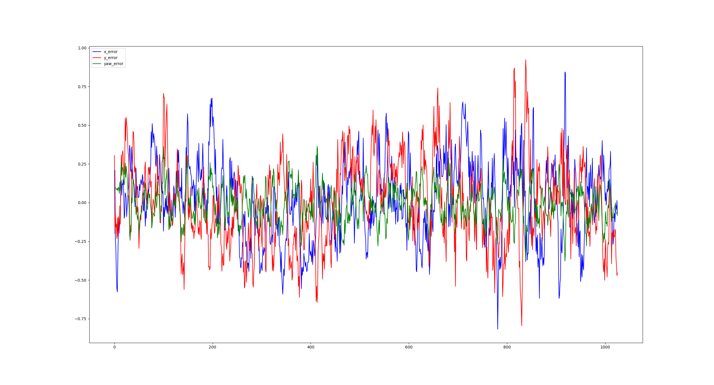
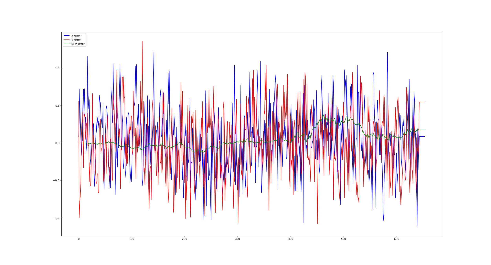

A one day exercise to perform localisation from encoder odometry and GNSS.

# Install

First clone the repo into your catkin workspace
`git clone https://github.com/Pyrojambo/short_localisation.git`
From root of catkin workspace run:
`rosdep install short_localisation`
then build the package
`catkin build short_localisation`
and source workspace
`source devel/setup.bash`

# Method 1:

I have used the extended Kalman filter (ekf) from [robot_localization](http://wiki.ros.org/robot_localization) before and know it was designed for exactly this task so initially spent some time using it to see what its estimate would be.
Also briefly tested the Unscented Kalman filter (ukf) but this performed much worse than the ekf and ekf is the recommended one to use in the majority of ROS use cases.

## Configuration

The parameters(short_localisation/config/ekf.yaml) for using robot_localisation were configured as follows:
- odom0 was set to use `sensors/odom`
    - Used the linear x and y velocities
    - Used the angular yaw position
        - Yaw position instead of velocity was used as we had no other reference for the yaw position and needed to have a starting position
    - pose outlier rejection was disabled so that our initial orientation would not be ignored

- odom1 was set to use `sensors/gnss/odom`
    - Used the linear x and y positions
    - pose outlier rejection was disabled so that our initial position would not be ignored

## Process

As we were given the assumption that the `map` and `odom` frames were the same, a tf2 static publisher was added to give both of these at the same point.
A `.rviz` configuration was also created to visualise the fusion and ground truth

## Run

Run
`roslaunch short_localisation robot_localisation.launch`
then press space to start `.bag` file

# Method 2:

Then I decided to implement my own naive version of odometry fusion to which I could compare the ekf result.

## Run

Run
`roslaunch short_localisation odom_bag.launch`
in one terminal, press space to start `.bag` file, then run
`roslaunch short_localisation custom_fusion.launch`
in another terminal

## Process

- Create a framework for subscribing to the ROS msgs and publishing the fused output and the `base_link` tf frame
    - Set up subscribers for both odometry sources
    - Set up publisher for the estimated odometry
    - Run the calculations and publish at the rate of the slower sensor (GNSS)
- Use a naive approach of averaging the positions to test the framework
    - Take the average of the pose from both odometry sources
- Extend the naive approach to use encoder velocities instead of pose
    - Store the encoder values until a GNSS value is received
    - Then calculate what the change in pose would be due to these encoder values
    - Then average this calculated pose change with the GNSS pose
- Add error recorder to take the ground truth and estimated odometry and calculate the error between them at each time step
    - Set up subscribers for the estimated odometry and the ground truth
    - Periodically check the time difference between the sources
    - If they are close enough calculate the difference between the odometry
- Save this error over time to a `.csv` file
    - Store the error as strings to be written to a csv file just before the code ends
- Write a script to load and plot the error
    - load the csv file and plot each of the errors on a graph

# Return to Method 1

If I were to implement a more sophisticated approach to the odometry fusion it would be to use a Kalman filter to predict and combine with the input sources. Given that a detailed and robust implementation of this already exists, I decided to use that rather than attempt to write what would amount to a less accurate and reliable version of it.

The `robot_localization` package provides a ROS service to set the initial pose, so I wrote a class that would subscribe to the initial GNSS odometry and call that service to provide an initial estimate to the ekf rather than have its initial pose be zero.

Some time was spent reading about and attempting to tune the ekf, but no noticeable improvement was gained in the available time.

However a comparision of the error from the ekf  to the naive approach  shows that the ekf gave a more accurate position estimate, but the naive approach gave a more accurate orientation estimate.

